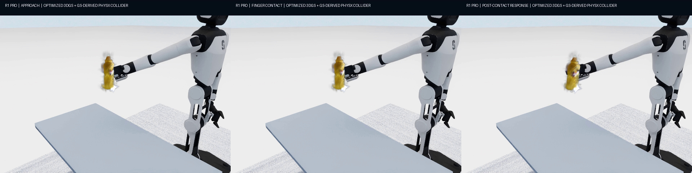
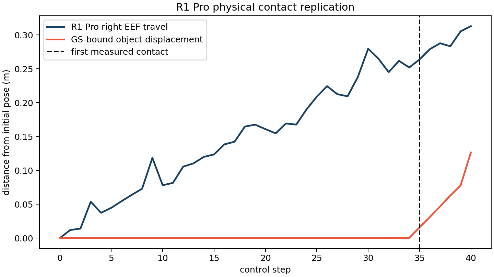
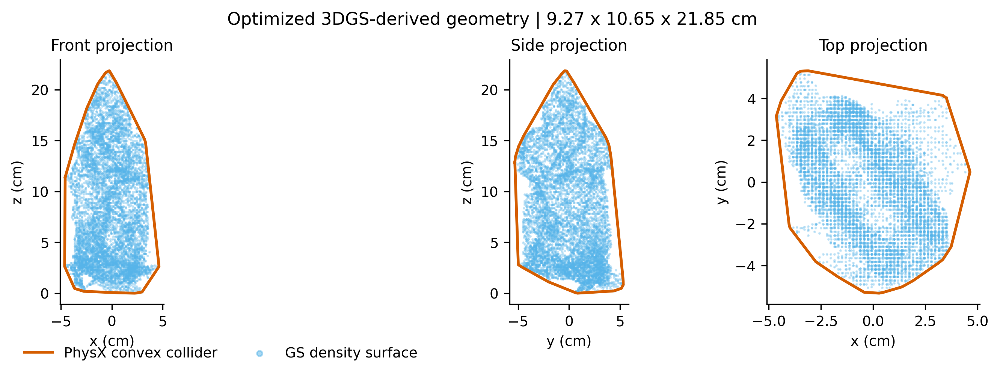

# GS로 복원한 물체의 물성을 어떻게 알아낼 것인가

3D Gaussian Splatting으로 병의 외관을 복원해도, 그 병을 밀었을 때 얼마나 움직이고 떨어뜨렸을 때 얼마나 튈지는 정해지지 않는다. 같은 형상에도 서로 다른 질량·마찰·반발계수가 대응할 수 있기 때문이다. 이 연구는 **복원된 강체에 물성의 불확실성을 부여하고, 관찰과 물리 실험을 통해 보지 않은 행동의 미래 운동을 더 잘 예측할 수 있는가**에서 출발했다. 대상은 YCB `006_mustard_bottle`이며, 2026년 8월 말의 OmniGibson·PhysX 실험에서 관측에 의한 추론, 탐색 행동의 선택, 실제 3DGS 학습, R1 Pro 접촉을 단계적으로 연결했다.

가장 분명한 결과는 수동 운동 관측의 효과였다. 12개 숨긴 물성 세계에서 평균 미래 위치 오차가 줄었다. 그러나 세 번의 기회를 적응적으로 배분한 탐색은 고정 순서보다 우수하다는 주가설을 뒷받침하지 못했다. 후속 실험에서는 학습한 Gaussian으로 충돌 형상을 만들고 로봇 손가락의 접촉까지 연결했지만, 형상의 깊이 오차와 불완전한 충격량 측정이 남았다. 이 결과들은 외관·접촉·물성 추론의 성립 조건을 각각 드러낸다.

*그림 1. 후속 `strict_v14` 실험의 접근·접촉·반응. 병은 실제 최적화한 Graphdeco Gaussian을 측정된 PhysX pose에 맞춰 렌더하고 로봇 영상에 합성한 것이다. 영중력에서 오른쪽 손가락 끝 접촉과 이후 운동을 확인한 자료이며, 접촉 검증 PASS와 질량 식별의 유효성은 별도 판정이다. 이 실행의 질량 측정은 보고 불가였고, 뒤의 frozen 최종 평가에도 이 실행이 입력되지 않았다.*

## 관측의 효과와 행동 선택의 효과를 나누어 묻다

[초기 프로젝트 기록](evidence/project-context/README.md)은 재질 prior, passive motion, active system identification을 결합하는 목표를 명시한다. 재질과 채움 정도에 대한 가정은 초기 추정에 필요하지만 외관만으로 내용물이나 접촉 특성을 확정할 수는 없다. 따라서 하나의 물성값을 즉시 정답으로 삼기보다, 질량·정지마찰·운동마찰·반발계수의 후보를 입자 belief로 유지하고 관측이 들어올 때 갱신했다. 이 prior는 경험 통계와 공학적 가정에 기반한다. 별도로 학습한 VLM이 물성을 추론했다는 실행 증거는 없다. [belief 구현](evidence/source-excerpts/belief.py)과 [관측 해석](evidence/source-excerpts/observations.py)이 실제 추론의 범위를 보여 준다.

실험은 먼저 수동 관측만으로 무엇이 달라지는지, 그다음 추가 행동의 선택이 얼마나 도움이 되는지를 나누었다. 한 가지 Gaussian 유래 형상을 고정하고 정확한 물성만 다른 12개 세계를 만들었다. 각 세계 안에서는 형상·passive 관측·센서 노이즈·held-out 행동을 공유하면서 prior only, prior+passive, fixed 3회, adaptive 3회를 비교했다. 이 paired 설계는 세계마다 다른 물성의 난이도를 공유한 상태에서 정보 조건의 차이를 비교하게 한다. 독립 평가 단위는 세계 12개이며 궤적의 프레임 수가 표본 수를 늘려 주지는 않는다.

식별에 사용한 행동 크기와 평가 행동 크기를 분리하고, 정답 물성은 oracle 쪽에 두었다. 새로운 impulse와 oblique drop의 궤적, 별도의 breakaway ramp를 평가한 이유도 파라미터를 맞히는 일과 행동 결과를 예측하는 일을 구분하기 위해서다. 다만 이 초기 pilot의 Gaussian은 정렬한 RGB-D에서 만든 초기 표현이며 photometric 3DGS 학습본이 아니다. 행동을 가한 주체도 simulator의 force·kinematic-board actuator였다. R1 Pro가 장면에 있다는 사실만으로 로봇이 탐색 접촉을 수행했다고 볼 수 없다. [pilot 설계와 결과](evidence/core-pilot/REPORT.md)

적응적 선택기는 posterior가 예측하는 측정값의 분산을 센서 노이즈로 정규화한 `sum(log1p(variance / sigma²))`에서 행동 비용과 위험 패널티를 뺀다. 구현상 posterior 후보들이 서로 다른 관측을 예측할수록 그 행동에 높은 점수를 주는 방식이다. 같은 행동은 반복하지 않지만 크기가 다른 같은 종류의 행동은 다시 선택할 수 있다. 이 설계는 관측의 정보량을 얻으려는 목적에는 연결되지만, **미래 궤적 오차가 얼마나 줄어드는지를 직접 계산하는 목적함수는 아니다.** 이후 실패를 이해하는 데 이 차이가 중요하다. [선택 점수와 decision trace](evidence/source-excerpts/selector.py)

## 수동 관측은 도움이 되었지만 적응 탐색의 우월성은 확인되지 않았다

| 증거 조건 | 12세계 평균 held-out translation NRMSE ↓ |
|---|---:|
| prior only | 0.288226 |
| prior + passive | 0.134466 |
| fixed 최종 | 0.150530 |
| adaptive 최종 | 0.146359 |

여기서 translation NRMSE는 각 궤적의 3차원 위치 RMSE를 물체 extent의 최댓값으로 나누고, impulse와 oblique-drop 두 행동에 대해 평균한 값이다. breakaway ramp의 힘 상대 오차는 별도 지표로 계산하며 위 평균에 포함하지 않는다. 정의는 전체 보존본의 `evaluation.py`와 `run_core_paired_physx.py`에 남아 있다. [코드 복원 위치](DATA_AND_RESTORE.md)

prior에서 passive로 넘어갈 때의 paired 평균 감소는 **0.153760**, 원 95% bootstrap 구간은 **[0.086585, 0.228931]**였다. 관측이 이 pilot에서 초기 가정보다 나은 미래 예측을 만들었다는 결론의 근거다. 반면 fixed와 adaptive의 주 비교는 마지막 오차 하나가 아니라, passive 직후와 active 1·2·3회 뒤의 오차 곡선을 간격 1의 사다리꼴로 적분한 AUC였다. AUC가 작을수록 좋으며 세계별 `fixed AUC − adaptive AUC`가 양수일 때 adaptive가 유리하다. [집계 정의](evidence/source-excerpts/statistics.py)

그 차이의 평균은 **−0.027459**, 95% 구간은 **[−0.149871, 0.059862]**, 양측 exact sign-flip p값은 **0.794434**였다. adaptive가 8개 세계에서 이기고 fixed가 4개에서 이겼지만, 큰 손실이 있는 세계와 효과의 불확실성을 함께 보면 우월성은 지지되지 않는다. 마지막 시점의 평균이 adaptive에서 조금 낮다는 사실도 여러 단계의 오차를 누적한 AUC 결론을 바꾸지 않는다. [원 수치 summary](evidence/core-pilot/report_summary.json)

가장 큰 adaptive 손실이 난 `unit_005`의 선택은 `incline:2 → vertical_accel:1.5 → vertical_accel:0.8`이었다. 세 번 중 두 번을 크기만 다른 질량 민감 행동에 쓰면서 낙하 probe가 빠졌다. 원 보고서는 반발계수의 불확실성이 남고, 재표본화가 prior의 파라미터 상관을 증폭해 관측하지 않은 반발계수까지 이동하면서 oblique-drop 예측이 실패했다고 분석한다. 선택 코드의 반복 허용 범위는 이 설명과 맞지만, posterior 상관의 인과 경로를 독립적으로 재검증한 실험 근거는 없다.

이 실패에서 읽을 수 있는 연구상의 함의는 정보량과 예측에 필요한 정보가 항상 같지는 않다는 점이다. 한 파라미터에 민감한 측정이 계속 유용해 보여도, 실제 평가가 다른 물성에 민감하면 제한된 탐색 기회를 놓칠 수 있다. 이는 저장된 결과에 대한 해석이며 개선된 선택기의 효과를 이미 확인했다는 뜻은 아니다. 더구나 fixed와 adaptive의 최종 평균은 passive만 사용했을 때보다 높았다. 추가 실험을 했다는 사실 자체가 평균 예측 개선을 보장하지 않았다.

정지마찰에서도 설정값과 행동상의 계수가 달랐다. nominal 정지마찰과 breakaway 유효 계수의 평균 차이는 약 **0.20355**였다. 초기 기록은 움직이는 kinematic incline가 nominal 한계에 이르기 전에 동적 미끄러짐을 일으킬 수 있음을 지적한다. 따라서 설정값을 가깝게 회복했는지와 실제 운동을 잘 예측했는지는 끝까지 따로 집계해야 한다.

조건별 평균·AUC 평균 차이·2¹²개 부호 조합의 p값은 2026-09-16 보존 검토에서 재계산되어 저장 결과와 일치했다. bootstrap 구간은 원 결과를 인용하며 새로 실행하지 않았다. [재계산 기록](evidence/numeric-verification.json) · [정답 열을 제거한 per-unit 오차](evidence/core-pilot/per-unit-errors.csv)

## 첫 로봇 실험은 손가락 접촉이 운동으로 전달되는지를 확인했다

pilot에서 실제 행동을 만든 것은 simulator actuator였으므로, 이후에는 로봇의 충돌 접촉이 Gaussian에 묶인 강체를 움직이는지 확인해야 했다. 대표 `unit_005`의 숨긴 물성과 같은 형상 해시를 재사용하고, R1 Pro의 28자유도 자세를 고정한 채 가상 base x를 8mm씩 이동했다. 중력을 0으로 두어 자유공간의 손·물체 접촉을 분리했다. 이 제한된 조건 덕분에 검사의 대상도 손가락 접촉의 존재와 물체 변위로 명확해졌다.

[**R1 Pro 초기 접촉 실험 영상**](evidence/r1-replication/r1_contact_replication.mp4)

*그림 2 및 영상. RGB-D 초기 Gaussian 형상과 kinematic base sweep을 사용한 영중력 시험이다. 영상은 제어 step마다 직접 simulator 카메라를 캡처한 71프레임·15fps·약 4.73초 기록이다. 첫 접촉은 step 35, contact-positive는 3개 step이며 최종 변위는 0.126386m였다. 정지 그림을 보간한 애니메이션이 아니며, 그림 1의 최적화 GS·팔 IK 실험과도 다른 실행이다.*

당시 통과 조건은 PhysX의 R1 finger/object contact와 2cm 이상의 이동이었다. 관측된 변위는 이 조건을 만족했지만, 고정 자세와 강제 base 이동은 정상 중력에서 로봇이 스스로 접근·조작하는 문제를 남긴다. 이 실험으로 확인한 범위는 로봇 접촉과 강체 운동의 연결이며, 12세계에서 지지되지 않은 adaptive 정책을 다시 입증한 것은 아니다. [접촉 보고서](evidence/r1-replication/REPORT.md) · [step별 요약](evidence/r1-replication/r1_contact_summary.json)

## RGB-D 초기점에서 실제 학습된 Gaussian으로 넘어가다

초기 pilot의 질문을 실제 3DGS 표현으로 확장하려면, RGB-D 초기점과 photometric optimization의 출력을 구분해야 했다. 후속 학습은 YCB mustard bottle의 보정된 RGB 480뷰를 320×240으로 준비하고, **50,641개 RGB-D 초기점에서 공식 Graphdeco optimizer를 7,000 iteration** 실행했다. 최종 Gaussian은 **22,843개**, 기록된 학습 wall time은 **223.6567초**다. 최종 PLY에는 위치·구면조화·opacity·scale·rotation 필드가 있으며 초기점 파일과 해시가 다르다. 실제 optimizer 실행, 출력 필드, 파일 계보가 학습 여부의 근거다. [학습 보고서](evidence/reports/graphdeco_training_report.md)

학습 PSNR은 38.7383dB였지만, 복원 품질은 학습에 사용하지 않은 시점에서 따로 검사했다. validation 60뷰와 test 60뷰는 학습 파일명과 겹침이 0이며 공식 Gaussian renderer로 렌더했다. 한 물체의 시점 분리이므로 다른 물체로의 일반화를 평가한 것은 아니다.

[**보지 않은 시점의 실제 영상과 학습된 3DGS 렌더 비교**](evidence/optimized-gs/heldout_real_vs_3dgs.mp4)

*영상. validation/test 120뷰의 외관 비교를 20초·12fps로 구성한 자료다. 원 holdout 보고서는 정면의 병과 라벨을 알아볼 수 있지만 위·아래 사선 시점에서는 흐림과 실루엣 번짐이 남는다고 기록한다. 병이 식별되는지와 물리 형상에 필요한 깊이·부피가 정확한지는 이 영상만으로 같은 결론을 내릴 수 없다.*

| 렌더 평가 | Full-frame PSNR ↑ | Full-frame SSIM ↑ | Reference-foreground PSNR ↑ |
|---|---:|---:|---:|
| validation 60뷰 | 32.8228dB | 0.992635 | 16.9769dB |
| test 60뷰 | 32.7417dB | 0.992652 | 16.8405dB |

PSNR은 [0,1] RGB의 MSE로 계산하고, foreground는 reference의 RGB 중 하나라도 250/255 미만인 픽셀로 정의했다. 표는 per-view 지표의 split 평균이며 SSIM은 공식 구현을 사용한다. 흰 배경이 큰 full-frame 점수와 foreground 점수의 차이는 평가 영역의 중요성을 보여 준다. 배경을 포함한 높은 유사도만으로 병 표면의 충실도를 판단할 수 없기 때문에, 사선 시점의 실루엣과 다음 단계의 독립 기하 오차를 함께 읽었다. [holdout 조건](evidence/reports/graphdeco_holdout_report.md) · [per-view JSON](evidence/optimized-gs/holdout_report.json)

학습 소스 revision은 `54c035f7834b564019656c3e3fcc3646292f727d`다. 당시 RTX 5060 Ti·PyTorch 2.7.0+cu128·CUDA 12.8 환경에서 한글/OneDrive 경로의 Ninja 문제를 ASCII build mirror로 우회한 기록도 남아 있다. 이는 당시 실행 환경의 기록이며 현재 설치를 다시 검증한 결과는 아니다. [환경 보고서](evidence/reports/graphdeco_environment_report.md)

## 렌더되는 형상과 충돌에 쓰는 형상은 얼마나 다른가

Gaussian의 외관을 물리 엔진으로 전달하려면 충돌 가능한 기하가 필요하다. 후속 construction은 최적화 PLY만 입력으로 받아 opacity·공간 필터로 22,843개 중 **11,359개**를 남겼다. 약 **1.7889mm voxel**, **85×92×160 density grid**, **isovalue 0.15**에서 marching cubes 표면을 만들고, PhysX에 전달할 단일 convex hull을 구성했다. 표면은 50,129 vertices·101,518 faces, hull은 158 vertices·312 faces이며 모두 watertight로 기록된다. 외부 decimation은 원래 닫힌 표면을 깨뜨려 채택하지 않았다. 이 선택은 물리용 형상의 유효성을 유지하는 과정이었지만, 단순화에 따른 형상 차이까지 제거하지는 못했다. [construction 코드](evidence/source-excerpts/gs_density_collider.py) · [고정 manifest](evidence/collider/geometry_manifest.json)

*그림 3. 파란 점은 GS density surface, 주황색 외곽은 PhysX convex collider의 정면·측면·윗면 투영이다. 축 단위는 cm이며 construction의 크기는 9.27×10.65×21.85cm다. 이 그림은 두 생성 형상의 관계를 보여 주며 reference mesh를 함께 그린 정확도 비교는 아니다. 실제 크기·표면·부피 오차는 아래의 평가 전용 YCB mesh 비교에서 계산했다.*

원 보고서는 construction manifest를 고정한 뒤 공식 YCB mesh를 평가 전용으로 가져왔다고 설명한다. 각 mesh에서 50,000점을 표본화하고 평행이동과 네 방향 yaw 중 정렬을 허용하되 scale fitting은 하지 않았다. 이 조건에서는 reference 크기에 사후로 맞추어 크기 오차를 지우지 않는다. 보존 검토는 manifest·보고서·수치를 대조한 범위이며 모든 과거 실행 순서를 별도 포렌식으로 증명한 것은 아니다.

| 기하 평가 | Density surface | Convex physics proxy |
|---|---:|---:|
| 평균 symmetric Chamfer ↓ | 7.326mm | 9.842mm |
| p95 Chamfer ↓ | 17.667mm | 20.809mm |
| Normal consistency ↑ | 0.5392 | 0.8302 |
| 크기 벡터 L2 상대 오차 ↓ | 21.56% | 21.56% |
| 부피 상대 오차 ↓ | 45.37% | 64.55% |

Chamfer는 양방향 최근접 표면 거리, normal consistency는 대응 법선의 일치 정도다. 부피 상대 오차는 reference에 대한 절대 상대 차이이며 density 표면은 과소, convex proxy는 과대였다. hull의 법선 일치도가 더 높아도 평균 표면 거리와 부피 오차는 더 크다. 하나의 수치만으로 더 좋은 물리 형상이라고 정할 수 없는 결과다. [기하 평가 JSON](evidence/collider/ycb_geometry_evaluation.json)

가장 큰 오차는 깊이였다. **10.65cm 대 reference 6.66cm**, 상대 오차 **59.84%**로 병이 과도하게 두꺼웠다. 사선 렌더에서 보이는 실루엣 번짐과 같은 방향의 문제이지만, 렌더 오차가 기하 오차를 만든 인과를 별도 실험으로 분리한 것은 아니다. 여기서 확실한 결론은 Gaussian에서 유래했다는 출처와 정확한 물리 형상이라는 성질이 별개라는 점이다. 현재 collider는 고정밀 실물 twin의 근거로 충분하지 않다. [collider 보고서](evidence/reports/optimized_gs_collider_report.md)

## 접촉이 성립해도 질량을 측정했다고 말할 수 없는 이유

최적화 GS의 `strict_v14`는 초기 base-sweep 실험보다 접촉의 원인을 좁혀 검사했다. base zero command·gravity compensation과 오른팔 Cartesian IK의 1.5mm 이동을 사용하고, 물체에 직접 외력을 가하지 않았다. wrist camera housing을 제외한 robot collision을 활성화하되 성공 판정은 오른쪽 손가락 끝 접촉만 허용했다. 접촉 전 이동, 허용되지 않은 link, 과도한 속도, 손의 가로 흔들림도 함께 검사했다. 다만 이 실행 역시 영중력 접촉 분리 시험이다. [접촉 검증 구현](evidence/source-excerpts/r1_contact.py)

[**Strict 접촉의 simulator 원본**](evidence/strict-contact/r1_controller_contact_raw.mp4) · [**측정 pose를 따라 렌더한 GS 합성 영상**](evidence/strict-contact/r1_gs_contact_composite.mp4)

*영상. raw에서는 대상 물체의 simulator 표시를 숨겼다. 합성본은 그 실행에서 측정한 물체 pose에 공식 Graphdeco GS를 렌더해 로봇 영상과 결합한 84프레임·15fps 기록이며, 그림 1은 접근·접촉·반응을 나누어 보여 준다. 따라서 raw의 로봇 움직임, PhysX의 접촉·pose 기록, 최종 Gaussian 외관은 서로 다른 증거다. [합성 manifest](evidence/strict-contact/r1_gs_contact_composite.json)가 renderer 입력과 collider 해시를 연결한다.*

첫 접촉은 step 23, 물체 운동 시작은 step 29, 최종 변위는 **16.677mm**, 접촉 시 visual gap은 **3.767mm**였고 strict validation은 PASS였다. 이것은 검사한 조건 안에서 손가락 접촉 뒤 물체가 움직였다는 결과다. 그러나 같은 run의 질량 식별은 **`valid_for_reporting=false`**, 상대 오차 **88.72%**로 기록되었다. [정답을 제거한 strict summary](evidence/strict-contact/r1_contact_summary.public.json)

실패 원인은 한 제어 프레임에 포함된 여러 physics substep 중 마지막 substep의 contact impulse만 읽어 전체 충격량을 놓친 데 있다. 운동량 변화와 연결할 입력 충격량이 불완전하면, 잔차가 작게 나온다는 사실만으로 질량 계측이 타당해지지 않는다. 이 실험은 물체가 움직였는지 확인하는 접촉 검증과, 그 움직임으로 질량을 알아내는 측정 검증에 서로 다른 조건이 필요함을 보여 준다.

보존된 [fusion 코드](evidence/source-excerpts/estimate_fusion.py)는 완료 status와 residual 범위를 검사하지만 `valid_for_reporting` flag 자체를 검사하지 않는다. 따라서 다음 구현에서는 모든 substep의 계측 완전성을 확인하고 불완전한 측정이 posterior 갱신에 들어가지 못하도록 수용 조건을 연결해야 한다. 완전성 flag를 반영한 수정·재평가 결과는 현재 보존 자료에 없다.

## 고정한 추정치의 미래 운동 오차와 그 입력 계보

최종 평가에서는 추정치를 먼저 고정하고 SHA-256을 기록한 뒤 별도 PhysX oracle에서 평가했다. frozen 파일의 해시는 평가 파일과 일치한다. 다만 입력 commitment를 따라가면 active 입력은 최신 `strict_v14`가 아니라 이전의 **`r1_contact_gs_unit_000_impulse_all_links`**다. 이 입력의 active mass measurement는 **`accepted=false`**였고 질량 posterior는 prior와 같다. 그러므로 최신 접촉 영상에서 질량을 알아낸 뒤 아래 결과를 얻었다는 단일 실행의 서사를 만들 수 없다. [frozen estimate 입력 감사](evidence/final-evaluation/frozen-estimate-audit.json)

| 최종 평가 지표 | 저장된 결과 |
|---|---:|
| 질량 / 정지마찰 상대 오차 | 27.57% / 33.20% |
| 운동마찰 / 반발계수 상대 오차 | 16.87% / 25.38% |
| held-out guided slide 위치 RMSE | 6.039mm / 55샘플 |
| held-out oblique drop 위치 RMSE | 9.033mm / 73샘플 |

물성 오차는 정답 대비 절대 차이의 백분율, 위치 RMSE는 동일 시각의 3차원 위치 차이 norm의 RMS다. 수십 %의 파라미터 오차와 수 mm의 짧은 미래 위치 오차가 함께 나타났다. 이는 한 물체·한 frozen estimate·같은 엔진의 지정 궤적에서 얻은 결과이며, 파라미터 정확도와 궤적 정확도를 대신 쓰지 않아야 하는 또 하나의 근거다. 특히 최종 질량은 접촉으로 갱신되지 않았으므로 좋은 위치 오차를 접촉 기반 질량 식별 성공으로 돌릴 수 없다. [공개 평가 요약](evidence/final-evaluation/evaluation.public.json)

## 이 결과가 남긴 다음 연구의 조건

현재 증거에서 먼저 해결해야 할 것은 측정의 타당성과 실행 계보다. 모든 physics substep impulse를 누적하고 독립적인 momentum balance로 점검한 뒤, 계측 완전성과 보고 가능성을 fusion의 수용 조건에 연결해야 한다. 입력·접촉·추정치·oracle·영상을 하나의 run ID와 해시로 묶어야 후속 결과를 실제로 하나의 연결된 시스템 평가로 해석할 수 있다.

탐색 쪽에서는 원 pilot 보고서가 제안한 미래 궤적 위험 감소 목적함수와 물성 종류별 최소 probe 조건을 별도의 후속 조건으로 비교할 수 있다. 새 blind 세계와 같은 행동 예산에서 비교 계획을 먼저 고정하고, 평균 AUC뿐 아니라 `unit_005`처럼 큰 실패가 나는 세계도 유지해야 한다. 이는 현재 선택기를 사후에 고쳐 기존 가설이 성공한 것으로 만드는 작업이 아니다.

형상 쪽에서는 silhouette·depth 보완과 여러 collider 구성을 비교하면서 깊이·부피·Chamfer와 미래 운동 오차를 함께 측정해야 한다. 그 뒤 정상 중력, 다른 물체와 자세, 다른 엔진 또는 실측 궤적으로 확장해야 한 형상·같은 PhysX 안에서 얻은 결과의 범위를 넘어설 수 있다. 이 순서는 보존된 실패에서 도출한 후속 연구 제안이며 아직 수행된 성과가 아니다.

## 자료의 출처와 재현 범위

이 기록의 기여는 prior·관측·입자 추론·행동 선택을 연결한 실험, 실제 GS 학습 출력의 검증, GS 유래 collider와 로봇 접촉의 연결, 부정 결과와 측정 실패의 분석에 있다. Graphdeco 학습·렌더러, YCB 원자료, OmniGibson·Isaac Sim·PhysX, R1 Pro 자산은 외부 기반이며 [ATTRIBUTION](ATTRIBUTION.md)에 구분했다. 원래의 상세 서술은 [RESEARCH_REPORT.md](RESEARCH_REPORT.md)에 바이트 그대로 보존되어 있다.

YCB 입력은 Berkeley RGB-D·고해상도 RGB archive와 준비 자료로 나뉜다. 전체 보존본에는 1,000/7,000 iteration checkpoint, 최적화 PLY, 실패 run, private oracle, robot assets, ASCII build mirror가 있다. 실패한 이전 mask/split의 `INVALID` 자료는 최종 split과 구분한다. Physion++는 추출한 물성 통계 파일만 확인되었으며 전체 corpus를 확보한 기록은 없다. 제한된 BEHAVIOR scene/object dataset도 설치 기록이 없으므로 robot asset 보유를 전체 환경 데이터 보유로 확대하지 않는다. 위치와 누락 범위는 [DATA_AND_RESTORE.md](DATA_AND_RESTORE.md)에 남겼다.

공개 [evidence](evidence/)는 보고서·선별 소스 15개·JSON/CSV·그림·영상 4개의 증거 묶음이다. hidden GT와 estimate·absolute error 조합으로 정답을 역산할 수 있는 필드는 [공개 필터](evidence/publication-filter.json)에 따라 제외했다. 대형 학습 자산·oracle·외부 dependency가 모두 들어 있는 독립 실행 package는 아니다.

재실행에는 별도 작업 복사본에서 manifest와 해시를 확인하고 `behavior`/`gs_graphdeco` 환경을 분리 복원한 뒤 robot/CUDA 확인, holdout 렌더, collider, contact, 새 blind 평가를 순서대로 연결해야 한다. 당시 OmniGibson 3.9.2·Isaac Sim 5.1.0·PyTorch 2.7.0+cu128과 [h5py 3.15.1 constraint](evidence/project-context/constraints-omnigibson-win.txt)는 복원의 출발점이다. 보존된 정답을 estimator에 다시 넣는 방식은 새 blind 평가를 대신하지 않는다.

2026-09-16 검토는 공개 수치 재계산, 소스 구문, 주요 이미지, 파일 해시와 입력 연결 대조까지 수행한 기록이다. GPU 재학습·PhysX 전체 재실행·새 PC 복원·USB 전송과 외부 사본 검증을 완료했다는 기록은 포함하지 않는다.
